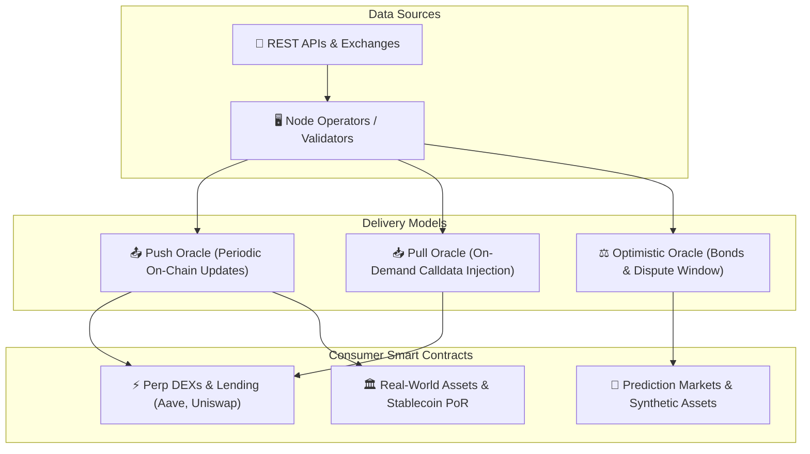

  

# 🔮 Awesome-Oracle-Network

  
  
  
  
  
  

---

## 🌟 Top Oracle Networks & Web3 Data Ecosystem
> **A Curated Directory of Production Decentralized Oracle Networks (DONs), Sub-Second Price Feeds, Verifiable Randomness (VRF), Real-World Asset (RWA) Feeds & Open-Source Repositories.**  
> *Last updated: August 2026*

Blockchain oracles form the mission-critical middleware bridge connecting deterministic smart contracts on EVM, Solana, Cosmos, and Move chains to real-time off-chain data (cryptocurrency market prices, equity & FX quotes, IoT telemetry, sports/prediction data, weather, proof of reserves, and cross-chain messages).

---

## 📑 Table of Contents
- [📊 SaaS & Hosted Oracle Platforms](#-saas--hosted-oracle-platforms)
- [💻 Open-Source GitHub Repositories](#-open-source-github-repositories)
- [🏗️ Architectural Paradigms & Best Practices](#️-architectural-paradigms--best-practices)
- [📈 Star History](#-star-history)
- [🤝 How to Contribute](#-how-to-contribute)
- [⚠️ Disclaimer](#️-disclaimer)

---

## 📊 SaaS & Hosted Oracle Platforms

> 📈 **Market Size & Industry Structure:** The global blockchain oracle and Web3 middleware market is estimated at **$2.8B – $4.5B** in annual capitalization (safeguarding over **$50B+ in Total Value Secured (TVS)** across DeFi and tokenized RWAs, projected to reach **$15B+ by 2032**). The sector is **moderately concentrated with a winner-take-most structure** at the institutional blue-chip tier (where Chainlink commands >50% TVS), while modular pull-based architectures (Pyth, RedStone) and optimistic/first-party oracles (UMA, API3) aggressively capture specialized high-frequency trading and Layer-2 market shares.

| Platform | Valuation / Market Size | Description | Starting Pricing | Free Tier Limits |
| :--- | :--- | :--- | :--- | :--- |
| **[Chainlink](https://chain.link/)** | **~$11.5B** *(FDV ~$18.5B)* | Category-leading decentralized oracle network securing the majority of DeFi TVS with price feeds, Data Streams, VRF, Functions, Proof of Reserve, and CCIP cross-chain messaging. | From ~$0.005–$0.20 per request (LINK token subscription for VRF/Functions) or gas-only for standard on-chain feeds; Data Streams from $500/month | Free forever reading of public sponsored price feeds (protocol-subsidized, user pays network gas only); 5 LINK/day testnet faucet allocation |
| **[Pyth Network](https://pyth.network/)** | **~$2.5B** *(FDV ~$2.5B / MC ~$1.2B)* | Sub-second, first-party pull oracle specialized in low-latency financial market data across crypto, equities, FX, and commodities across 50+ blockchains. | From ~$0.0001 per on-chain price update (target chain fee) / Dedicated Hermes node endpoints from $50/month | Free forever public Hermes API tier limited to 10 requests every 10 seconds per IP (90 req / 10s for TradingView endpoint); unlimited testnet usage |
| **[Supra](https://supraoracles.com/)** | **~$1.0B** *(Private Valuation)* | High-throughput multi-chain oracle, decentralized VRF (dVRF), and cross-chain communication network with ultra-fast finality. | From ~$0.01 per request (credits pegged in USDC via $SUPRA staking from 1,000 SUPRA minimum) | 6-month free trial via SNAP (Supra Network Activate Program) offering 100% subsidized oracle & dVRF calls for eligible projects; unlimited testnet faucet |
| **[UMA Optimistic Oracle](https://uma.xyz/)** | **~$350M** *(Market Cap / FDV)* | Optimistic oracle system tailored for subjective claims, prediction markets (e.g. Polymarket), cross-chain bridging, and insurance with economic dispute resolution (DVM). | Minimum assertion bond / `finalFee` starting at ~0.0001 ETH (~$0.25–$1.00 in collateral) refunded upon finalization | Free forever to query resolved assertions; 100% bond refund for correct assertions without disputes + testnet faucet with unlimited test assertions |
| **[RedStone](https://redstone.finance/)** | **~$250M** *(Series A Valuation)* | Modular, gas-optimized oracle providing Core (on-demand calldata pull), Classic (push cache), and X (front-running protection for perp DEXs) delivery models. | From ~$0.001–$0.05 gas overhead per pull request (calldata injection); enterprise bespoke feeds from $500/month | Free forever for RedStone Core pull data packages via decentralized cache nodes / Showroom; unlimited access on testnets |
| **[API3](https://api3.org/)** | **~$180M** *(Market Cap / FDV)* | First-party oracle infrastructure (Airnode + dAPIs) eliminating third-party middlemen and returning Oracle Extractable Value (OEV) directly to dApps. | From ~$299/feed/year for managed dAPIs or self-funded proxy gas (~$0.01–$0.05 per update) | Free forever open-source Airnode (self-hosted with 0 protocol fees); unlimited read access to sponsored public dAPIs & testnet feeds |
| **[Band Protocol](https://bandprotocol.com/)** | **~$160M** *(Market Cap / FDV)* | Cross-chain data oracle platform aggregating off-chain APIs and real-world data via decentralized BandChain validators. | From ~$0.005–$0.01 per query (paid in BAND tokens to validators for data fetching/relaying) | Free forever reading of Band Standard Dataset price feeds cached on supported chains; unlimited BandChain Laozi testnet queries |
| **[Tellor](https://tellor.io/)** | **~$150M** *(Market Cap / FDV)* | Permissionless, transparent oracle protocol where reporters stake TRB and compete to submit validated data on-demand. | From ~0.001 TRB (~$0.05) minimum tip per on-demand data request + transaction gas | Free forever reading of existing Enshrined Feeds (e.g., ETH/USD, BTC/USD) without tipping; unlimited reporter requests on testnets |
| **[DIA](https://www.diadata.org/)** | **~$60M** *(Market Cap / FDV)* | Multi-chain open-source oracle platform delivering customizable price feeds, NFT floor data, and cross-asset feeds directly from primary exchange sources. | From ~$99/month for standalone REST API / $250/month for custom on-chain production feeds | Free forever evaluation REST API (limited to specific test asset endpoints for evaluation); free access to testnet oracles |
| **[Witnet](https://witnet.io/)** | **~$20M** *(Market Cap / FDV)* | Decentralized, permissionless oracle network running on its own chain with cryptographic proofs (RAD) and economic incentives for truth reporting. | From ~$0.005–$0.02 (1 WIT / bridge gas equivalent) per custom RAD (Retrieve-Attest-Deliver) request | Free forever reading of sponsored public price feeds via Witnet Price Feeds Router; unlimited testnet requests |

---

## 💻 Open-Source GitHub Repositories

Sorted in descending order of GitHub community stars ⭐:

1. **[smartcontractkit/chainlink](https://github.com/smartcontractkit/chainlink)**   
   The core repository for the Chainlink node, Go daemon, EVM contracts, VRF, and cross-chain interoperability protocol tooling.

2. **[smartcontractkit/chainlink-brownie-contracts](https://github.com/smartcontractkit/chainlink-brownie-contracts)**   
   Official packaged Chainlink smart contracts and interfaces for EVM development, Hardhat, Foundry, and Brownie.

3. **[UMAprotocol/protocol](https://github.com/UMAprotocol/protocol)**   
   Core smart contracts, optimistic oracle contracts, and Data Verification Mechanism (DVM) voting tooling for UMA.

4. **[smartcontractkit/foundry-starter-kit](https://github.com/smartcontractkit/foundry-starter-kit)**   
   Production-ready Foundry starter kit demonstrating how to integrate Chainlink Price Feeds, VRF, and Functions with automated testing.

5. **[diadata-org/diadata](https://github.com/diadata-org/diadata)**   
   Transparent, open-source oracle platform and data scraper microservices providing customizable financial price feeds and market statistics.

6. **[pyth-network/pyth-crosschain](https://github.com/pyth-network/pyth-crosschain)**   
   Cross-chain contracts, Hermes pull services, and SDK connectors powering the high-frequency Pyth price feed ecosystem across 50+ networks.

7. **[witnet/witnet-rust](https://github.com/witnet/witnet-rust)**   
   The reference Rust implementation of the Witnet decentralized oracle protocol node, blockchain state machine, and consensus mechanism.

8. **[api3dao/airnode](https://github.com/api3dao/airnode)**   
   Serverless first-party oracle node software that enables REST API providers to securely publish verifiable data directly onto smart contracts.

9. **[bandprotocol/chain](https://github.com/bandprotocol/chain)**   
   The Cosmos SDK-based blockchain implementation powering BandChain decentralized oracle network data requests and validator aggregation.

10. **[switchboard-xyz/sbv2-solana](https://github.com/switchboard-xyz/sbv2-solana)**   
    Switchboard V2 oracle program, client SDK, and task runner framework on Solana, Aptos, and Sui for custom data feeds and verifiable randomness.

11. **[witnet/witnet-solidity-bridge](https://github.com/witnet/witnet-solidity-bridge)**   
    Solidity bridge contracts, routers, and client interfaces for consuming Witnet feeds and requests from any EVM chain.

12. **[chronicleprotocol/scribe](https://github.com/chronicleprotocol/scribe)**   
    MakerDAO's original and upgraded oracle infrastructure (Chronicle Protocol) featuring gas-efficient Schnorr signature aggregation (`Scribe`).

13. **[tellor-io/usingtellor](https://github.com/tellor-io/usingtellor)**   
    Solidity helper library and contracts for effortlessly reading, integrating, and tipping Tellor oracle data in decentralized applications.

14. **[tellor-io/telliot](https://github.com/tellor-io/telliot)**   
    The official Python reporter client and CLI tool used by Tellor data providers to submit values and participate in dispute resolutions.

15. **[redstone-finance/redstone-oracles-monorepo](https://github.com/redstone-finance/redstone-oracles-monorepo)**   
    Monorepo containing RedStone data service nodes, cache layers, price packager contracts, and verification pipelines.

16. **[redstone-finance/redstone-evm-connector](https://github.com/redstone-finance/redstone-evm-connector)**   
    EVM smart contract connector and calldata extraction wrappers enabling sub-second pull oracle integration.

17. **[tellor-io/tellorFlex](https://github.com/tellor-io/tellorFlex)**   
    Staking and dispute resolution smart contracts powering Tellor's multi-chain deployment on Layer 2 rollups and EVM sidechains.

---

## 🏗️ Architectural Paradigms & Best Practices

### 💡 Core Delivery Models
1. **Push Oracles (Classic):** Node operators periodically push price updates on-chain when deviation thresholds (e.g. 0.5%) or heartbeat intervals (e.g. 1 hour) are met. Standard for lending markets requiring persistent storage.
2. **Pull Oracles (On-Demand):** Data is signed off-chain and injected directly into the user's transaction calldata by the dApp frontend, verified instantly on-chain with minimal gas overhead. Ideal for high-frequency perp exchanges.
3. **Optimistic Oracles:** Data is proposed with a staked bond and assumed true unless challenged within a liveness window. Optimized for complex, subjective, or natural-language claims.
4. **First-Party Oracles (Airnode):** API data owners operate the node directly without third-party middleman relays, eliminating rent-seeking and capturing OEV.

---

## 📈 Star History

---

## 🤝 How to Contribute
1. 🍴 Fork the repository.
2. 📝 Add or update entries in `README.md` (keep descriptions concise, factual, and include links).
3. 🚀 Submit a Pull Request with a clear description of your contribution.

---

## ⚠️ Disclaimer
- This repository is a **community-curated index** provided for research, architectural comparison, and educational purposes.
- Blockchain oracles represent mission-critical smart contract infrastructure. Always perform comprehensive audits, stress-test latency and dispute models, and implement multi-source fallback mechanisms before deploying production protocols.

---

  <b>Built with ❤️ for Web3 developers, DeFi architects, and smart-contract engineers.</b> 
  Keep oracle infrastructure transparent, decentralized, and community-audited.

